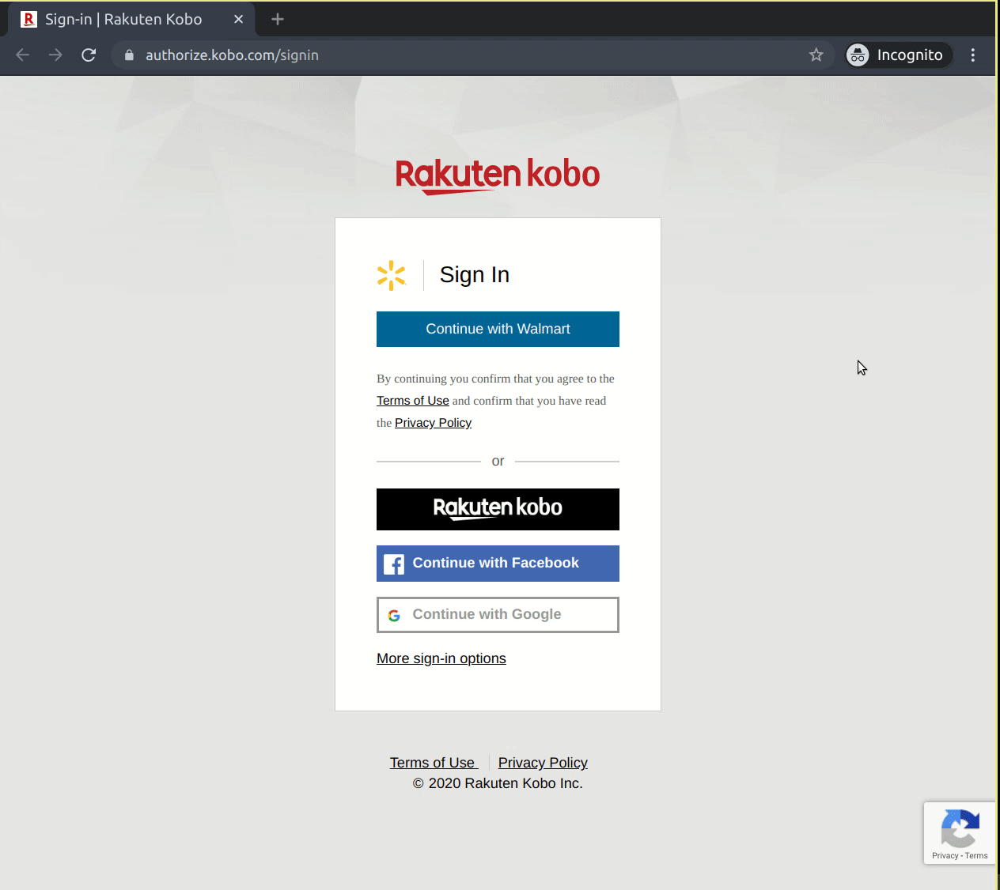

# Kobodl

This is a hard fork of [kobo-book-downloader](https://github.com/TnS-hun/kobo-book-downloader), a command line tool to download and remove Digital Rights Management (DRM) protection from media legally purchased from [Rakuten Kobo](https://www.kobo.com/). The resulting [EPUB](https://en.wikipedia.org/wiki/EPUB) files can be read with, amongst others, [KOReader](https://github.com/koreader/koreader).

## Features

kobodl preserves the features from `kobo-book-downloader` :

* stand-alone; no need to run other software or pre-download through an e-reader.
* downloads `.epub` formatted books

it adds some new feautres

* multi-user support; fetch books for multiple accounts.
* web interface; adds new browser gui (with flask)
* [docker image](https://hub.docker.com/r/subdavis/kobodl)
* [pypi package](https://pypi.org/project/kobodl/)

## Web UI

Web UI is a work in progress, and is currently read-only.


## Installation

with pipx

``` bash
pipx install kobodl
```

with pypi

``` bash
pip3 install kobodl
```

with docker

``` bash
docker run --rm -it --user $(id -u):$(id -g) \
  -v ${HOME}/.config/kobodl.json:/.config/kobodl.json subdavis/kobodl \
  user list
```

## Examples

Get started by adding one or more users

``` bash
~$ kobodl user add
```

List books from multiple accounts

``` bash
~$ kobodl book list

# +---------------------------------+-----------------------------+--------------------------------------+---------------------------+
# | Title                           | Author                      | RevisionId                           | Owner                     |
# |---------------------------------+-----------------------------+--------------------------------------+---------------------------|
# | Dune                            | Frank Herbert               | c1db3f5c-82da-4dda-9d81-fa718d5d1d16 | user@example.com          |
# | Foundation                      | Isaac Asimov                | 3e12197c-681a-4a53-80b4-88fcdf61e936 | user@example.com          |
# | Girls Burn Brighter             | Shobha Rao                  | 1227cc03-7580-4469-81a5-b6558500832f | user@example.com          |
# | On Earth We're Briefly Gorgeous | Ocean Vuong                 | 4ccc68b1-3dac-433e-b05a-63ab0f93578f | other@domain.com          |
# | She Said                        | Jodi Kantor                 | 5d0872bf-8765-4654-9f90-aca4f54e5707 | other@domain.com          |
# +---------------------------------+-----------------------------+--------------------------------------+---------------------------+
```

Download a book

``` bash
~$ kobodl book get -u user@example.com c1db3f5c-82da-4dda-9d81-fa718d5d1d16

# Downloading book to kobo_downloads/Isaac Asimov - Foundation.epub
```

Run the web ui

``` bash
~$ kobodl serve

#  * Serving Flask app "kobodl.app" (lazy loading)
#  * Environment: production
#    WARNING: This is a development server. Do not use it in a production deployment.
#    Use a production WSGI server instead.
#  * Debug mode: off
#  * Running on http://127.0.0.1:5000/ (Press CTRL+C to quit)
```

## Getting a reCAPTCHA code

Adding a user requires a bit of hackery to get a reCAPTCHA code from Kobo's website.  This GIF helps to explain how to do that.




## Development

To get set up for development:

1. clone this repo
2. create a virtual environment (optional)
3. `pip3 install -e .` to install for development
4. `kobodl` should be available inside the virtual env

## Release

First, update setup.py's version, then run the following

``` bash
docker build -t subdavis/kobodl .
docker push subdavis/kobodl

python3 setup.py sdist bdist_wheel
twine upload dist/*
```

## Notes

kobo-book-downloader will prompt for your [Kobo](https://www.kobo.com/) e-mail address and password. Once it has successfully logged in, it won't ask for them again. Your password will not be stored on disk; Kobodl uses access tokens after the initial login.

Credit recursively to [kobo-book-downloader](https://github.com/TnS-hun/kobo-book-downloader) and the projects that lead to it.

